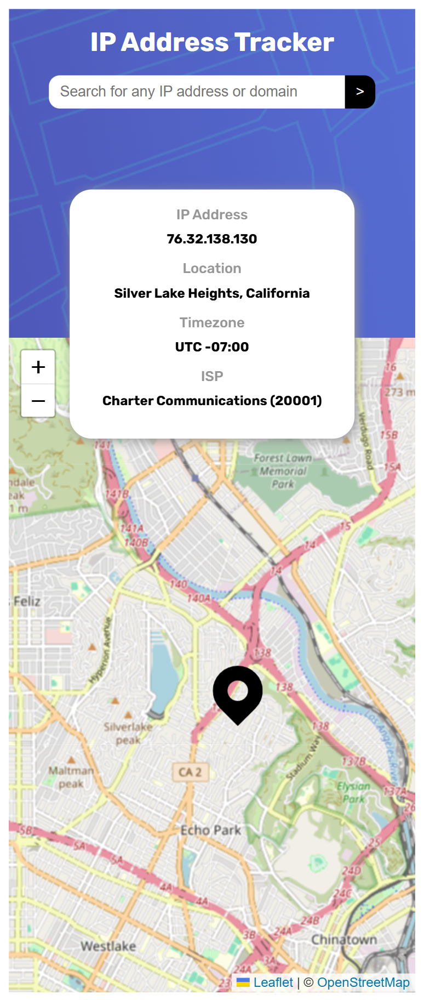

# Frontend Mentor - IP address tracker solution

This is a solution to the [IP address tracker challenge on Frontend Mentor](https://www.frontendmentor.io/challenges/ip-address-tracker-I8-0yYAH0). 

## Table of contents

- [Overview](#overview)
- [Implementation Details](#my-process)
  - [Built with](#built-with)
  - [Input Validation](#input-validation)
  - [Data Fetching](#data-fetching)
  - [Application Integration](#application-integration)
- [Author](#author)
- [Acknowledgments](#acknowledgments)

## Overview

The application is a single-page website that displays information about an IP address, including its location, time zone, and Internet Service Provider (ISP). When a user lands on the page, the website automatically shows this information for their own IP address.

The site also includes an input field that allows users to search for any domain name or IP address. Once a search is submitted, the website displays detailed information related to the entered address or domain.

The website is hosted on github pages and can be accessed on this [link](https://aram-1999.github.io/ip-address-tracker/). Bellow are some examples of how the webpage might look:

<figure>
  
  <figcaption>mobile view</figcaption>
</figure>

<figure>
  
  <figcaption>desktop view</figcaption>
</figure>

## Implementation Details

### Built with

- Semantic HTML5 markup
- CSS custom properties
- Flexbox
- [LeafletJS](https://leafletjs.com/)
- [IP Geolocation API by IPify](https://geo.ipify.org/)
- JavaScript
- Mobile-first workflow

The project provides a dynamic and user-friendly interface for retrieving and displaying data based on user-provided input. Below is a detailed breakdown of the key features and how each component contributes to the overall functionality:

### Input Validation

The webpage includes an input field that accepts only a domain name (for example, google.com) or an IP address (for example, 192.168.1.1). Input validation is handled by JavaScript helper functions located in utilityFunctions.js
, which use regular expressions to verify the correctness of the input. The validation process ensures that the field is not left empty and that the entered value strictly matches either a valid IP address or domain name format. If the validation fails, the user is notified with a clear error message and the focus is moved to the input field.

### Data Fetching

All data retrieval operations are managed by the API service module found in apiService.js. This module is responsible for fetching data during the initial page load as well as when a user submits a domain name or an IP address. The functions within this file handle the communication with external APIs by ensuring a clean separation of concerns. This approach allows the page to update dynamically and efficiently in response to user input.

### Application Integration

The main entry point of the project, index.js
, serves as the central integration layer. It imports and coordinates all core modules, including the validation utilities from utilityFunctions.js, the API logic from apiService.js, and the custom error handling from customErrors.js. By combining these components, index.js establishes the full client-side workflow—validating user input, fetching corresponding data, handling errors gracefully, and rendering results in a cohesive and responsive web experience.

## Author

- Aram Torosyan

## Acknowledgments

I would like to express my sincere gratitude to Abraham Tavarez, my Per Scholas instructor, for his guidance and support in helping me understand how to effectively research and utilize API documentation.
